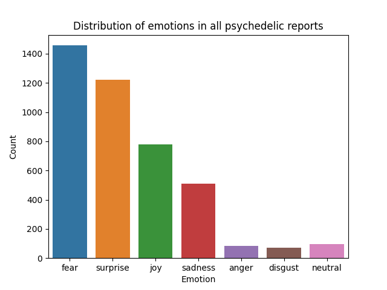

<br />
  <h1 align="center">Emotion classification of psychedelic trip reports</h1> 
  <h3 align="center">
  Author: Aleksander Moeslund Wael <br>
  </h3>
</p>

---

## About the project
This repo contains code for conducting emotion classification on a large text dataset. The goal of this project is to analyze the emotion of retrospectively written psychedelic trip reports to further understand the subjective experience of psychedelic states. Emotion classification is performed on all reports using a pretrained language model. The overall emotion present in the corpus and the differences between psychedelic substances is analyzed and discussed.

### Data
The dataset used for this project was originally obtained for use in the author's bachelor project, *Comparing subjective psychedelic experiences across substances using the BERTopic model* (Wael, 2023). It consists of reports obtained from the [Erowid Experience Vaults](https://erowid.org/experiences/), which collects and publishes people's experiences with psychoactive plants and chemicals. There are approximately 39,000 reports in the vaults, covering experiences with about 950 substances. Each report includes a title, author, substance type, and the writer's experience. Some reports provide additional information such as dose, body weight, route of administration, year of experience, gender, and age. Reports must be approved by at least two members of the Erowid Reviewing Crew to be included. The data was collected by scraping the report site, focusing on the title, substance, and report. Combination substances were excluded, and pseudonymous handles and personal information were not collected to comply with GDPR regulations. The final dataset includes 4,219 reports describing experiences with LSD (n = 1130), psilocybin (n = 1783), mescaline (n = 355), Ayahuasca (n = 120), DMT (n = 652), and 2C-B (n = 179).

### Model
The model used for the emotion classification task is the `j-hartmann/emotion-english-distilroberta-base` transformer model from the HuggingFace platform (Jochen Hartmann, "Emotion English DistilRoBERTa-base". [HuggingFace link](https://huggingface.co/j-hartmann/emotion-english-distilroberta-base/), 2022). The model is a finetuned version of the `distilroberta-base` model. It predicts Ekman's 6 basic emotions plus a neutral class: `anger`, `disgust`, `fear`, `joy`, `neutral`, `sadness` and `surprise`.

### Pipeline
The `psych_classification.py` follows these steps:
1. Import necessary packages
2. Set up a text classification pipeline
3. Load data
4. Classify emotions in reports
5. Save classifications in the `df_python_emotion.csv` file
5. Create a plot showing the distribution of emotions in all reports
6. Create plots for each substance's reports
7. Save plots to `plots` folder

## Requirements

The code is tested on Python 3.11.2. Futhermore, if your OS is not UNIX-based, a bash-compatible terminal is required for running shell scripts (such as Git for Windows).

## Usage

The repo was setup to work with Windows (the WIN_ files), MacOS and Linux (the MACL_ files).

### 1. Clone repository to desired directory

```bash
git clone https://github.com/alekswael/NLP_emotion_classification_psychedelics
cd NLP_emotion_classification_psychedelics
```
### 2. Run setup script 
**NOTE:** Depending on your OS, run either `WIN_setup.sh` or `MACL_setup.sh`.

The setup script does the following:
1. Creates a virtual environment for the project
2. Activates the virtual environment
3. Installs the correct versions of the packages required
5. Deactivates the virtual environment

```bash
bash WIN_setup.sh
```

### 3. Run pipeline
**NOTE:** Depending on your OS, run either `WIN_run.sh` or `MACL_run.sh`.

Run the `*run.sh` script. The script does the following:
1. Activates the virtual environment
2. Runs `emotion_classification.py` located in the `src` folder
3. Deactivates the virtual environment

```bash
bash WIN_run.sh
```

## Repository structure
This repository has the following structure:
```
│   .gitignore
│   MACL_run.sh
│   MACL_setup.sh
│   README.md
│   requirements.txt
│   WIN_run.sh
│   WIN_setup.sh
│   
├───data
│       df_python.csv
│
├───plots
│       all_data_plot.png 
│       multi_plot.png
│
└───src
        psych_classification.py
```

## Remark on findings

When looking at the cumulated distribution of emotions in all psychedelic reports, it seems fear, surprise and joy are the most prevalent emotions. Perhaps this is related to the altered perception and thought processes reported by users; it would make sense that these induce surprise, but also a good amount of fear. The same surprise might also be responsible for the high proportion of joy emotion.

It should be noted that although all emotions get a score for each report, the report is classified according to the highest emotion score. Therefore, a report is either classified as fear or surprise, although it might contain both. A considerable amount of information is lost with this method. It could be interesting to view the summed score for all emotions for all reports.

Furthermore, the data is highly skewed in regards to sample size, which makes a cumulative visualisation like the figure below less informative.



*Figure. Distribution of emotions in all psychedelic reports.*

When looking at the per-substance distributions of emotions, it appears that the most prevalent emotion for each substance is also fear. The 2nd, 3rd and 4th most prevalent emotions are surprise, joy and sadness, although the proportion of each is different per substance.

The only substance which is remarkably differnt in regards to emotions is mescaline. For this substance, fear, surprise, joy and sadness are almost equally distributed, and disgust is also prevalent. This substance, alongside ayahuasca, is one of the more spiritually loaded substances. Perhaps this is part of the explanation why the emotion distribution for mescaline is different compared to the other substances.

Of course, the other explanation is that variations in emotion distributions further the understanding of the effects of substances, but it is quite difficult to attribute these findings to such a claim. There are simply to many unknown variables.


*Figure. Distribution of emotions per substance.*
